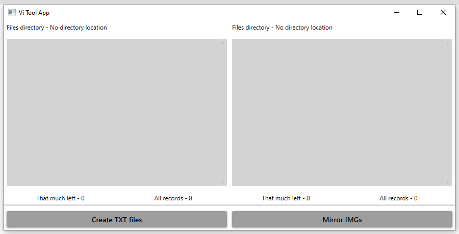

# Vi Tools App

## This app allows user to:
- Load dataset containing jpgs and their xmls, 
- Create mirrored copy, 
- Translate xml files to txt files which is understanded by darknet

## Workflow
1. Use `labelImg` software to create labels for dataset
2. Use `Vi Tools App -> Mirror IMGs` to create mirror of your dataset
3. Use `Vi Tools App -> Create TXT files` to translate xmls to txt for darknet

## Xml file structure

``` xml
<annotation>
    <folder>folder</folder>
    <filename>file name</filename>
    <path>jpg path</path>
    <source>
        <database>Unknown</database>
    </source>
    <size>
        <width>864</width>
        <height>1159</height>
        <depth>1</depth>
    </size>
    <segmented>0</segmented>
    <object>
        <name>class name</name>
        <pose>Unspecified</pose>
        <truncated>0</truncated>
        <difficult>0</difficult>
        <bndbox>
            <xmin>intiger</xmin>
            <ymin>intiger</ymin>
            <xmax>intiger</xmax>
            <ymax>intiger</ymax>
        </bndbox>
    </object>
</annotation>
```

## Txt file structure
```
1 0.52502 0.46065 0.09259 0.68766
```
## Guindline

## Links

- https://github.com/AlexeyAB/darknet

- https://github.com/tzutalin/labelImg